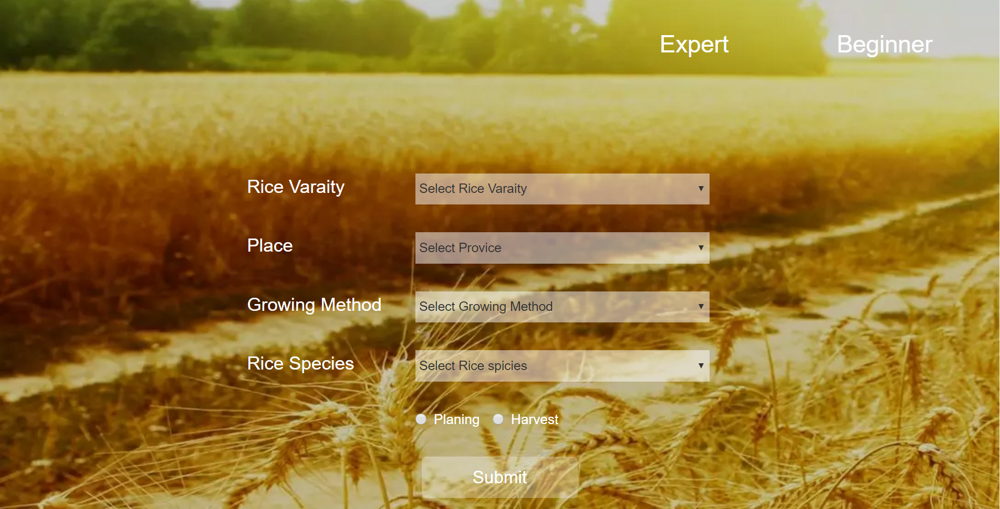

# :fire::fire::fire: API documentation :fire::fire::fire:

## Big picture

  128.199.192.241 <br>
  |-api/ <br>
  |&nbsp;&nbsp;|- [rices](#rices)/ <br>
  |&nbsp;&nbsp;|-[provinces](#provinces)/ <br>
  |&nbsp;&nbsp;|-[districts](#districts)/ <br>
  |&nbsp;&nbsp;|-[sub-districts](#sub-districts)/ <br>
  |&nbsp;&nbsp;|-[mehthods](#methods)/ <br>
  |&nbsp;&nbsp;|-[locations](locations)/ <br>
  |&nbsp;&nbsp;|-[photo-sensitivitys](#photo-sensitivitys)/ <br>
  |&nbsp;&nbsp;|-[havesting-date](#havesting-date)/ <br>
  |&nbsp;&nbsp;|-[planting-date](#planting-date)/ <br>
  |&nbsp;&nbsp;|-[season](#season)/ <br>
  |-[home](#home)

## Rice
<table>
  <tr>
    <th>Path</th>
    <th>JSON</th>
  </tr>
  <tr>
  <td>
/api/rice/
 </td>
 <td>
      <div class="highlight highlight-json"><pre>
      {
          rices:[
            {name:"rd15"},
            {name:"rd15"},
            {name:"rd15"},
            {name:"rd15"},
            {name:"rd15"},
          ]
      }
    </pre></div>
    </td>
    </tr>
    
    <tr><td>
/api/rices/?name=rd1
 </td>
 <td>
    {
      name="rd1"
      detail="good for consumming"
    }
 </td>
 </tr>

  <tr><td>
  
  /api/rices/?provinces=bangkok&provinces=chatuchak&sub-districts=bangken
</td><td>
 <div class="highlight highlight-json"><pre>
  {
    rices:[
      {name:"rd15"},
      {name:"rd15"},
    ]
  }
  </pre></div>
</td>
</tr>
<tr><td>
/api/rices/?provinces=bangkok&provinces=chatuchak
</td><td>
 <div class="highlight highlight-json"><pre>
  {
    rices:[
      {name:"rd15"},
      {name:"rd15"},
      {name:"rd15"},
      {name:"rd15"},
    ]
  }
    </pre></div>
</td>
</tr>
</table>
## Provinces
- /api/provinces
```JSON
  provinces:[
    {name:"bangkok"},
    {name:"bangkok"},
    {name:"bangkok"},
    {name:"bangkok"},
    {name:"bangkok"},
  ]
```
- /api/province?rice=rd1
```JSON
  provinces:[
    {name:"bangkok"},
    {name:"bangkok"},
    {name:"bangkok"},
  ]
```
## Districts
- /api/districts
```JSON
  districts:[
    {name:"chatuchak"},
    {name:"chatuchak"},
    {name:"chatuchak"},
    {name:"chatuchak"},
  ]
```
- /api/districts?province=bangkok
```JSON
  districts:[
    {name:"chatuchak"},
    {name:"chatuchakhatuchak"},
    {name:"chatuchak"},
  ]
```
- /api/districts?rice=rd1
```JSON
  districts:[
    {name:"chatuchak"},
    {name:"chatuchak"},
  ]
```
- /api/districts?province=bangkok&rice=rd1
```JSON
  districts:[
    {name:"chatuchak"},
    {name:"chatuchak"},
```
  ]
## Sub Districts
- /api/sub-district/
```JSON
  sub-district:[
    {name:Commit
    }
  ]
```
## Methods
## Locations
## Photo Sensitivitys
## Havesting Date
## Planting Date
## Season
## home
  
